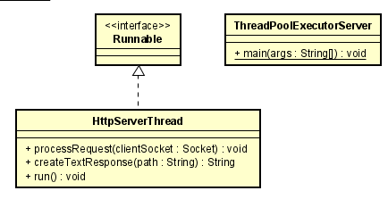

# Threads Server
### Daniel Santiago Ducuara Ardila
### 16/06/2021

## Resumen
Este taller consta de dos ejercicios, el primer ejercicio es realizar un servidor de datagramas con el objetivo de que un servidor envíe como respuesta a un cliente
la fecha actual. El segundo ejercicio consiste en realizar un servidor que lea páginas html concurremente mediante hilos.
## Diagrama de clases

### Paquete Datagram
 
El paquete Datagram consta de dos clases principales, DatagramTimeServer que es un servidor que responde la hora actual del servidor, consta de métodos para crear
la conexión. iniciar el servidor y retornar la hora actual, se incluyó un hilo para que retorne la hora cada 5 segundos y que se mantenga encendido el servidor. 
DatagramTimeClient es el cliente que recibe las respuestas del servidor cada 5 segundos. Para la ejecución es necesario iniciar primero el servidor y posteriormente
el cliente, automáticamente el cliente recibirá la fecha actual y irá recibiendo respuestas cada 5 segundos. 

### Paquete Http
 
El paquete Http consta de dos clases,HttpServerThread se encarga de crear un servidor que soporte múltiples solicitudes, la clase cuenta con métodos como startServer 
en el cual se inicia la conexión al servidor, en el método processRequest se crea la solicitud del servidor y en el método createTextResponse retorna la información 
del archivo html. La clase ThreadPoolExecutorServer se utilizará un solo hilo que va a ir creando el servidor y las solicitudes las irá almacenando en cola para 
posteriormente ejecutarlas.Para la ejecución es necesario iniciar la clase ThreadPoolExecutorServer y en el navegador colocar 127.0.0.1:35000/archivo, para la parte 
del archivo se encuentran 3 archivos en la carpeta TestHttpServer para probar con dichos archivos.

## Reporte de pruebas
Se realiza el reporte de pruebas con todas las pruebas satisfactorias.
- La primera prueba es comparar la hora que retorna el servidor con la hora actual.
   
- Para las pruebas de HttpServer se encuentra la carpeta TestHttpServer con 3 archivos html, es necesario iniciar la clase ThreadPoolExecutorServer y 
  en el navegador colocar 127.0.0.1:3500/Test1HttpServer.html dependiendo del archivo. 
   
  Se comprueba con la primera página 
   
  Se comprueba con la segunda página 
   
  Se comprueba con la tercera página 
   
- Para la prueba de datagrama se debe iniciar el DatagramTimeServer y posteriormente DatagramTimeClient, se comprueba que el servidor responda cada 5 segundos la fecha,
  posteriormente se apaga y se enciende el servidor y el resultado debe ser el mismo,que cada 5 segundos reciba respuestas del servidor.
   
### Productividad
La productividad de este proyecto fue de 250LOC/5 horas .
